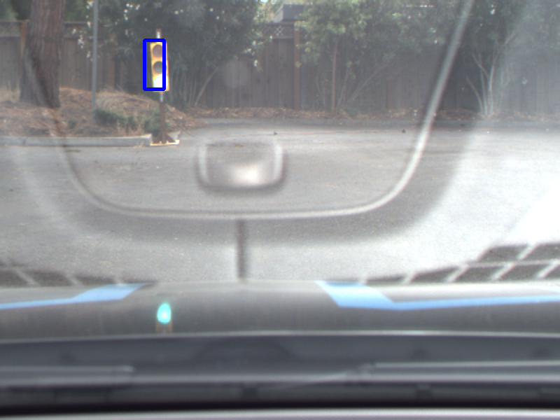
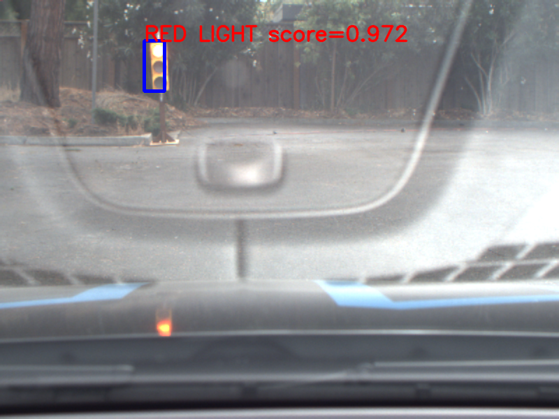

This is the project repo for the final project of the Udacity Self-Driving Car Nanodegree: Programming a Real Self-Driving Car. For more information about the project, see the project introduction [here](https://classroom.udacity.com/nanodegrees/nd013/parts/6047fe34-d93c-4f50-8336-b70ef10cb4b2/modules/e1a23b06-329a-4684-a717-ad476f0d8dff/lessons/462c933d-9f24-42d3-8bdc-a08a5fc866e4/concepts/5ab4b122-83e6-436d-850f-9f4d26627fd9).

### Members of Powerthrough Team

* [Mikkel Fly Kragh](https://github.com/mikkelkh) - mikkelkragh@gmail.com
* [Philippe Weingertner](https://github.com/PhilippeW83440) - philippe.weingertner@gmail.com
* [Peter Christiansen](https://github.com/PeteHeine) - repetepc@gmail.com
* [Oleg Potkin](https://github.com/olpotkin) - olpotkin@gmail.com
* [Sebastian Stümper](https://github.com/sstuemper) - sebastian.stuemper@gmail.com

<p align="center">
     
     <br>rosbag-play.gif
</p>

### Carla Self-Driving Car

Vehicle: 2016 Lincoln MKZ.  
Sensors: 2 Velodyne VLP-16 LiDARs, 1 Delphi radar, 3 FLIR (Point Grey) Blackfly cameras, Xsens IMU.   

<p align="center">
     
     <br>Carla.jpg
</p>

Udacity Self-Driving Car Harware Specs
- 31.4 GiB Memory
- Intel Core i7-6700K CPU @ 4 GHz x 8
- GPU TITAN X
- 64-bit OS Ubuntu 16.04 with ROS Kinetic


<p align="center">
     
     <br>Carla2.jpg
</p>

https://medium.com/udacity/how-the-udacity-self-driving-car-works-575365270a40

### Architecture Diagram


### Traffic Light Detection Node
<p align="center">
     
     <br>tl-detector.png
</p>

<p align="center">
     
     <br>green-traffic-light.png
</p>

<p align="center">
     
     <br>red-traffic-light.png
</p>

### Waypoint Updater Node

<p align="center">
     
     <br>waypoint-updater.png
</p>

### Waypoint Follower Node

- Pure Pursuit from Autoware

### Drive By Wire Node

<p align="center">
     
     <br>dbw.png
</p>


### Native Installation

* Be sure that your workstation is running Ubuntu 16.04 Xenial Xerus or Ubuntu 14.04 Trusty Tahir. [Ubuntu downloads can be found here](https://www.ubuntu.com/download/desktop).
* If using a Virtual Machine to install Ubuntu, use the following configuration as minimum:
  * 2 CPU
  * 2 GB system memory
  * 25 GB of free hard drive space

  The Udacity provided virtual machine has ROS and Dataspeed DBW already installed, so you can skip the next two steps if you are using this.

* Follow these instructions to install ROS
  * [ROS Kinetic](http://wiki.ros.org/kinetic/Installation/Ubuntu) if you have Ubuntu 16.04.
  * [ROS Indigo](http://wiki.ros.org/indigo/Installation/Ubuntu) if you have Ubuntu 14.04.
* [Dataspeed DBW](https://bitbucket.org/DataspeedInc/dbw_mkz_ros)
  * Use this option to install the SDK on a workstation that already has ROS installed: [One Line SDK Install (binary)](https://bitbucket.org/DataspeedInc/dbw_mkz_ros/src/81e63fcc335d7b64139d7482017d6a97b405e250/ROS_SETUP.md?fileviewer=file-view-default)
* Download the [Udacity Simulator](https://github.com/udacity/CarND-Capstone/releases/tag/v1.3).

### Docker Installation
[Install Docker](https://docs.docker.com/engine/installation/)

Build the docker container
```bash
docker build . -t capstone
```

Run the docker file
```bash
docker run -p 4567:4567 -v $PWD:/capstone -v /tmp/log:/root/.ros/ --rm -it capstone
```

### Usage

1. Clone the project repository
```bash
git clone https://github.com/udacity/CarND-Capstone.git
```

2. Install python dependencies
```bash
cd CarND-Capstone
pip install -r requirements.txt
```
3. Make and run styx
```bash
cd ros
catkin_make
source devel/setup.sh
roslaunch launch/styx.launch
```
4. Run the simulator

### Real world testing
1. Download [training bag](https://drive.google.com/file/d/0B2_h37bMVw3iYkdJTlRSUlJIamM/view?usp=sharing) that was recorded on the Udacity self-driving car (a bag demonstraing the correct predictions in autonomous mode can be found [here](https://drive.google.com/open?id=0B2_h37bMVw3iT0ZEdlF4N01QbHc))
2. Unzip the file
```bash
unzip traffic_light_bag_files.zip
```
3. Play the bag file
```bash
rosbag play -l traffic_light_bag_files/loop_with_traffic_light.bag
```
4. Launch your project in site mode
```bash
cd CarND-Capstone/ros
roslaunch launch/site.launch
```
5. Confirm that traffic light detection works on real life images
