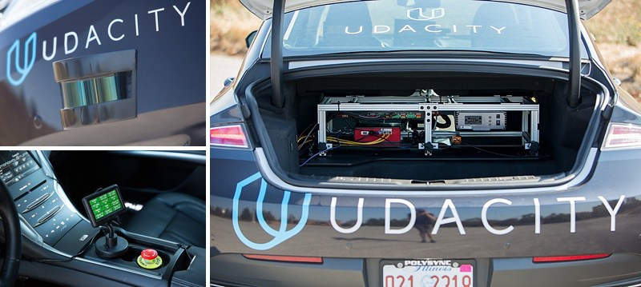
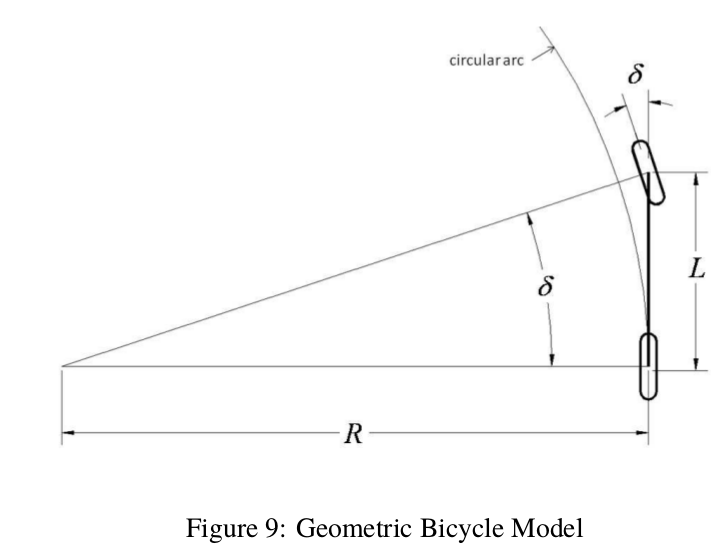

This is the project repo for the final project of the Udacity Self-Driving Car Nanodegree: Programming a Real Self-Driving Car. For more information about the project, see the project introduction [here](https://classroom.udacity.com/nanodegrees/nd013/parts/6047fe34-d93c-4f50-8336-b70ef10cb4b2/modules/e1a23b06-329a-4684-a717-ad476f0d8dff/lessons/462c933d-9f24-42d3-8bdc-a08a5fc866e4/concepts/5ab4b122-83e6-436d-850f-9f4d26627fd9).

### Members of Powerthrough Team

* [Mikkel Fly Kragh](https://github.com/mikkelkh) - mikkelkragh@gmail.com
* [Philippe Weingertner](https://github.com/PhilippeW83440) - philippe.weingertner@gmail.com
* [Peter Christiansen](https://github.com/PeteHeine) - repetepc@gmail.com
* [Oleg Potkin](https://github.com/olpotkin) - olpotkin@gmail.com
* [Sebastian Stümper](https://github.com/sstuemper) - sebastian.stuemper@gmail.com

<p align="center">
     
     <br>rosbag-play.gif
</p>

### Carla Self-Driving Car

Vehicle: 2016 Lincoln MKZ.  
Sensors: 2 Velodyne VLP-16 LiDARs, 1 Delphi radar, 3 FLIR (Point Grey) Blackfly cameras, Xsens IMU.   

<p align="center">
     
     <br>Carla.jpg
</p>

Udacity Self-Driving Car Harware Specs
- 31.4 GiB Memory
- Intel Core i7-6700K CPU @ 4 GHz x 8
- GPU TITAN X
- 64-bit OS Ubuntu 16.04 with ROS Kinetic


<p align="center">
     
     <br>Carla2.jpg
</p>

https://medium.com/udacity/how-the-udacity-self-driving-car-works-575365270a40

### Architecture Diagram


### Traffic Light Detection Node

**Parameters:**
- /traffic_light_config: map related information with stop line positions. 

**Subscribers:**
- /current_pose: ego (x, y) position. Populated by Autoware locatization module (GPS+LIDAR based).
- /base_waypoints: path planned as a discrete set of (x, y) positions
- /traffic_lights: map related information with traffic lights line positions. 
- /image_color: raw camera sensor information

**Publisher:**
- /traffic_waypoint: waypoint where we want to stop (at RED Traffic Light)

**Loop: 3 HZ**
- every 333 ms: 
     - Search the closest waypoint (base_waypoint closest to current_pose)
     - Search the closest known traffic light (based on map /traffic_lights information)
     - Last received /image_color is analyzed for RED/NOT RED detection/classification.
     - If RED is detected: publish the /traffic_waypoint i.e. waypoint where we want to stop

<p align="center">
     
     <br>tl-detector.png
</p>

Three approaches have been considered:
1) Use Traffic Light coordinates information and camera calibration data to extract bounding boxes around traffic lights and do a per bounding box Computer Vision colors HLS analysis to extract pixel information RED/YELLOW/GREEN. This is the approach used by Autoware.
2) Use transfer Learning to train a RED/NOT RED classifier for the whole image.
2) Use an object detector (like SSD or FASTER_RCNN) to extract bounding boxes around traffic lights and do a per bounding box Computer Vision colors HSV analysis to extract pixel information RED/NOT RED.

The 1st approach is potentially very fast: no need for a Deep Neural network. Nevertheless it can only detect Traffic Lights that are part of an already knwon map.  So it lacks genericity. Moreover in the context of this project the camera calibration data was not provided by Udacity. So it was not applicable here.  

The 2nd approach is a very classical one:
- Start with a network like VGG, GoogleNet, SSD, FasterRCNN trained on a very big data set. Use it a s a powerfull front end in charge of features extraction.
- Add a small back-end: train only the top-level of the network, the rest of the network remains fixed
This approach is appropriate when the new dataset is small and similar to the original dataset. The higher-level features learned from the original dataset should transfer well to the new dataset. Nevertheless it requires a custom training based on a small dataset that has to be collected and prepared for training.

The 3rd approach is a mixture of the 2 first approaches eliminating the need for a custom training and that should generalize pretty well on new data.


The 3rd approach has been implemented:
- faster_rcnn_inception_v2.pb from Tensorflow model zoo was chosen. It provided much better results out of the box than SSD; especially when dealing with small objects with traffic lights still far away. In terms of inference time on a GTX 1080 TI it is around 70 ms for a full image of size 1024x2048x3: so we could process more than 10 fps for Traffic Light detectionn which is more than enough.
- Per detected Traffic Light bounding box (by FASTER_RCNN) pixel analysis is performed:

```python
    def select_lighton_real(self, img): # HLS for real
        """Applies color selection for high L and S """
        hls_img = cv2.cvtColor(img, cv2.COLOR_RGB2HLS)
        lower = np.array([ 50,   150, 150], dtype="uint8")
        upper = np.array([ 100, 255, 255], dtype="uint8")
        tl_mask = cv2.inRange(hls_img, lower, upper)
        return cv2.bitwise_and(img, img, mask = tl_mask)
    
    def select_red_simu(self, img): # BGR for simu
        lower = np.array([ 0,   0, 200], dtype="uint8")
        upper = np.array([ 50, 50, 255], dtype="uint8")
        red_mask = cv2.inRange(img, lower, upper)
        return cv2.bitwise_and(img, img, mask = red_mask)
        
tl_img_simu = self.select_red_simu(tl_img) # SELECT RED in simulation
tl_img_real = self.select_lighton_real(tl_img) # SELECT LIGHT ON
tl_img = (tl_img_simu + tl_img_real) / 2 # So it works with SIMU and REAL cases
gray_tl_img = cv2.cvtColor(tl_img, cv2.COLOR_RGB2GRAY)     
```
- Compute center of mass of RED/LIGHT-ON points: if center of mass is in the 1/3 upper part of the bounding box it is a RED traffic light. In the case of Udacity Traffic Lights, as RED and YELLOW are very similar, only the spatial location is different, this approach is quite effective and generalizes well. 

  
Below 2 examples are shown:
- RED light detection on the right
- NOT RED detection on the left


<p float="left">
   
  
</p>

### Waypoint Loader Node

- From Autoware

```xml
<?xml version="1.0"?>
<launch>
    <node pkg="waypoint_loader" type="waypoint_loader.py" name="waypoint_loader">
        <param name="path" value="$(find styx)../../../data/wp_yaw_const.csv" />
        <param name="velocity" value="40" />
    </node>
</launch>
```

**Parameters:**
- load a csv file corresponding to a path to follow + a configurable maximum velocity

**Publisher:**
- /base_waypoints: set of waypoints and associated target velocity corresonding to a planned path (note that we stop at the end of the planned path)


### Waypoint Updater Node


**Subscribers:**
- /current_pose: ego (x, y) position. Populated by Autoware locatization module (GPS+LIDAR based).
- /base_waypoints: path planned as a discrete set of (x, y) positions
- /traffic_waypoint: -1 or a number > 0 corresponding to a waypoint where we should stop (RED light match)
- /current_velocity: linear and angular veocity. Here we use only the linear velocity.

The key callback of this node is **traffic_cb** called at every /traffic_waypoint update.  
- If 1st detection of a RED Traffic Light: compute a deceleration path ( in SQRT; Not a linear decrease: the faster the decrease the closer to the stop position )
```python
for wp in range(closest_wp_index, traffic_wp_index):
     dist = self.distance(self.waypoints, wp+1, traffic_wp_index)
     vel = math.sqrt(2 * MAX_DECEL * dist) 
     current_vel = self.get_waypoint_velocity(self.waypoints[wp+1])
     vel = min(vel, current_vel)
     if vel < 1.:
          vel = 0.
     self.set_waypoint_velocity(self.waypoints, wp+1, vel)
```
- If end of red light: we restore the original planned path and its associated velocities.


**Publisher:**
- /final_waypoints: a set of waypoints and their associated velocity (based on object/traffic light detection information) that we should follow

**Loop: 10 HZ**
- every 100 ms: 
     - Find the closest waypoints (with base_waypoint)
     - Extract LOOKAHEAD_WPS waypoints (typically 200 points). Per waypoint velocity has been already updated by /traffic_waypoint callback
     - Publish /final_waypoints
 


<p align="center">
     
     <br>waypoint-updater.png
</p>

### Waypoint Follower Node

- Pure Pursuit from Autoware
  
For more details cf:   
https://www.ri.cmu.edu/pub_files/pub3/coulter_r_craig_1992_1/coulter_r_craig_1992_1.pdf  
https://www.ri.cmu.edu/pub_files/2009/2/Automatic_Steering_Methods_for_Autonomous_Automobile_Path_Tracking.pdf  


**Parameters:**
- /linear_interpolate_mode:  

**Subscribers:**
- /final_waypoints: 
- /current_pose:
- /current_velocity:


**Publisher:**
- /twist_cmd: target linear and angular velocity


### Drive By Wire Node


**Parameters:**
- vehicle_mass:
- fuel_capacity
- brake_deadband
- decel_limit
- accel_limit
- wheel_radius
- steer_ratio
- max_lat_accel
- max_steer_angle

**Subscribers:**
- /twist_command: target linear and angular velocity sent by waypoint_follower


**Publisher:**
- /vehicle/steering_cmd: 
- /vehicle/throtlle_cmd: 
- /vehicle/brake_cmd: 

**Loop: 50 HZ**
- every 20 ms: 

```
     - Compute steering command:
          - steering_angle = angular_velocity * steer_ratio as a first approximation for low speeds
          - steering_angle = atan(L/R) 
               with L=wheel_base and R=radius_of_curvature=linear_velocity/angular_velocity=ds/dtheta
```

<p align="center">
               
</p>
          
<p float="left">
   
   
   
</p>

     - Compute acceleration: (target_velocity - current_velocity) / duration
     - Compute torque: in Nm, vehicle_mass * acceleration * wheel_radius
     - Compute throttle command: a value between [0; 1] the ratio of max possible torque (corresponding to max acceleration)
     - Compute brake command: if throttle < -(brake_deadband) => use abs(torque)
     - A 1st order Low Pass Filtering (alpha=0.33) is applied to the above commands to ensure smooth commands.
 
 A PID controller could be used; but was not.  
 The problem would be in tuning Kp, Ki, Kd especially without direct access to the real car ...  
 An MPC controller would be a better, more generic and self tunable solution. Cf next possible steps.


<p align="center">
     
     <br>dbw.png
</p>

### Rosbag Tests Howto

Some notes on testing and checking results with a rosbag file:  
  
1) Download https://drive.google.com/open?id=0B2_h37bMVw3iT0ZEdlF4N01QbHc4  
   you get a file: udacity_succesful_light_detection.bag  
2) Rename the file to dbw_test.rosbag.bag  
3) Move the dbw_test.rosbag.bag file to the project root’s data folder, e.g. CarND-Capstone/data/dbw_test.rosbag.bag  
4) Run dbw_test: roslaunch src/twist_controller/launch/dbw_test.launch  
5) Launch rviz in another terminal just to visualize camera and lidar sensors   
When test is done:  
6) Compare your results to the dbw_test output logged in ros/src/twist_controller in three files: brakes.csv, steers.csv, throttles.csv  

  
Carla vs simulation specificities:
We are at very low speed: < 20 km/h  
1) Throttle is at max 0.025 (instead of 1 potentially at regular speeds)  
2) Brake is not in Nm (mass * accel * wheel_radius) but in (accel * wheel_radius) apparently ...   
   Use a percentage mode: percentage vs mass  
   cf: https://github.com/udacity/sdc-issue-reports/issues/1204  
3) Steer is (or can be just computed as) proposed_angular_velocity (as sent by pure pursuit) * steer_ratio ... that is all ...
   It results in more agressive steering which is OK and even usefull at such low speed  
With these modifications we have a very good match match while running dbw_test.py on dbw_test.rosbag.bag  
  
TL test howto:  
1) roslaunch launch/site.launch  
2) rosbag play udacity_succesful_light_detection.bag  
3) check all images in: ros/src/tl_detector/light_classification/debug/imageXXX.png  
  
GPU WARNING:   
- Carla is using a powerfull GPU Titan X
- Code was tested with a GTX 1080 TI, GTX 980 TI and a GTX 1050
- Faster_rcnn is used for TL detection every 333 ms: so the GPU should run faster_rcnn on an image in less than 333 ms 
  (minus time for other nodes processing and minus time for simulator graphics if you are using it ...)

### Conclusion and Next Steps

- Almost no brake command outside deceleration phases
- MPC support
- Profiling
- Traffic Light Detection optimization

### References

### Native Installation

* Be sure that your workstation is running Ubuntu 16.04 Xenial Xerus or Ubuntu 14.04 Trusty Tahir. [Ubuntu downloads can be found here](https://www.ubuntu.com/download/desktop).
* If using a Virtual Machine to install Ubuntu, use the following configuration as minimum:
  * 2 CPU
  * 2 GB system memory
  * 25 GB of free hard drive space

  The Udacity provided virtual machine has ROS and Dataspeed DBW already installed, so you can skip the next two steps if you are using this.

* Follow these instructions to install ROS
  * [ROS Kinetic](http://wiki.ros.org/kinetic/Installation/Ubuntu) if you have Ubuntu 16.04.
  * [ROS Indigo](http://wiki.ros.org/indigo/Installation/Ubuntu) if you have Ubuntu 14.04.
* [Dataspeed DBW](https://bitbucket.org/DataspeedInc/dbw_mkz_ros)
  * Use this option to install the SDK on a workstation that already has ROS installed: [One Line SDK Install (binary)](https://bitbucket.org/DataspeedInc/dbw_mkz_ros/src/81e63fcc335d7b64139d7482017d6a97b405e250/ROS_SETUP.md?fileviewer=file-view-default)
* Download the [Udacity Simulator](https://github.com/udacity/CarND-Capstone/releases/tag/v1.3).

### Docker Installation
[Install Docker](https://docs.docker.com/engine/installation/)

Build the docker container
```bash
docker build . -t capstone
```

Run the docker file
```bash
docker run -p 4567:4567 -v $PWD:/capstone -v /tmp/log:/root/.ros/ --rm -it capstone
```

### Usage

1. Clone the project repository
```bash
git clone https://github.com/udacity/CarND-Capstone.git
```

2. Install python dependencies
```bash
cd CarND-Capstone
pip install -r requirements.txt
```
3. Make and run styx
```bash
cd ros
catkin_make
source devel/setup.sh
roslaunch launch/styx.launch
```
4. Run the simulator

### Real world testing
1. Download [training bag](https://drive.google.com/file/d/0B2_h37bMVw3iYkdJTlRSUlJIamM/view?usp=sharing) that was recorded on the Udacity self-driving car (a bag demonstraing the correct predictions in autonomous mode can be found [here](https://drive.google.com/open?id=0B2_h37bMVw3iT0ZEdlF4N01QbHc))
2. Unzip the file
```bash
unzip traffic_light_bag_files.zip
```
3. Play the bag file
```bash
rosbag play -l traffic_light_bag_files/loop_with_traffic_light.bag
```
4. Launch your project in site mode
```bash
cd CarND-Capstone/ros
roslaunch launch/site.launch
```
5. Confirm that traffic light detection works on real life images
